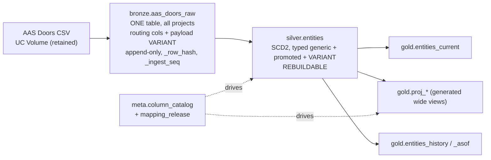
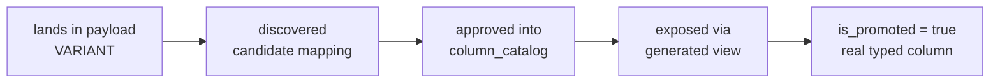

# Databricks Lakehouse Architecture — Bosch, AAS Doors

**Customer:** Bosch
**Source system:** AAS Doors — CSV extracts (currently feeding Splunk)

**1300 distinct columns** across all projects: roughly 20–30 **generic** columns shared by every
project plus 100–150 **project-specific** columns each. All source values arrive as strings.

Note what 1300 implies: if each project really carries 100–150 own columns, the projects must
already share far more than the 20–30 nominally-generic ones, or there are fewer projects than
assumed. Either way it is worth measuring before building — see [Open items](#open-items).

## Requirements driving the design

| # | Requirement | Consequence |
|---|---|---|
| 1 | Filter/analyse at project level **and** across all projects | One physical fact table with typed core columns |
| 1a | **Primary access pattern is `project_id` + `level`** — `level` is generic across all projects | Both are clustering keys and mandatory mapped columns, never left in `payload` |
| 2 | Columns get added and changed over time | `VARIANT` tail + metadata-driven catalog, not `ALTER TABLE` |
| 3 | Every table is **SCD Type 2** | Single row per entity per version — one validity timeline |
| 4 | All source columns are strings | All typing happens in one deliberate silver cast layer |
| 5 | Project columns map to a shared generic name (`Status_Ferrari` → `status`) | `meta.column_catalog`: source column → generic column, per project. **Names only — values are passed through as-is.** |
| 6 | Must rebuild silver with the column mapping that was in force at the time | `meta.column_catalog` is versioned by release; silver = pure function of bronze + mapping release |
| 7 | **One bronze table for all projects**, few generic columns + project-unique columns in payload | `bronze.aas_doors_raw`: routing/ordering columns only, all data in `payload VARIANT` |
| 8 | **Silver must be fully rebuildable from bronze**, using the mappings appropriate at that time | Deterministic replay: no wall-clock in silver, SCD2 derived from `_ingest_seq` ordering |
| 9 | **One file per project per delivery**, either a full load or a delta | `_load_mode` on every bronze row, taken from the `<project>/<full\|delta>/` folder; absence is only meaningful in a full load |
| 10 | Both delivery styles merge into the same SCD2 timeline, **retaining all history** | Version boundaries come from `_row_hash`; deletes become tombstone versions, never physical deletes |
| 11 | Projects deliver in parallel and in arbitrary order | **One ingest job, one writer**, processing every pending file per run — parallelism lives in delivery, not in the pipeline |

## Core decisions

1. **No 1300-column table anywhere.** Delta only collects stats on the first 32 columns by
   default, rows would be ~90% NULL, and every new project would churn the shared schema.
   1300 is smaller than the 4000 originally assumed but not small enough to change this: a
   wide table only becomes reasonable in the low hundreds of *densely populated* columns.
2. **Silver is the one physical SCD2 table.** Typed core columns + promoted hot project
   columns + a `VARIANT` payload for the tail. Core/extension tables were rejected because
   two SCD2 tables joined on a key force an interval-overlap join on every query.
3. **Gold is mostly views.** Duplicating the dataset buys nothing; silver is already the
   right shape. Materialise only for heavy dashboards / Splunk feeds.
4. **Mapping is names only.** A source column is renamed to a shared generic name; its *values*
   are stored exactly as they arrive. No value harmonisation, no controlled vocabularies, no
   lookup tables — deliberately out of scope until a consumer proves they need it.
5. **Mapping stays logical until it stabilises.** Regenerating a view re-maps all history at
   zero compute cost.
6. **Change detection is catalog-free and mapping-blind.** `_row_hash` covers the whole raw
   normalised source row, so a column-catalog edit can never re-version an entity.
7. **One bronze table for all AAS Doors projects.** `VARIANT` absorbs the per-project schema
   divergence, so a shared table costs nothing and gives a single replay source, one Auto
   Loader stream, and one place to reason about ordering.
8. **Silver is disposable.** It can be dropped and rebuilt from bronze at any time, for any
   mapping release. Nothing may exist in silver that cannot be re-derived from bronze + `meta.*`.
9. **`project_id` and `level` are the primary access pattern.** Both are mapped, `NOT NULL`
   columns and clustering keys — never resolved out of `payload` at query time.
10. **Full and delta loads share one code path.** The only thing the pipeline needs to know is
    which kind each file was, recorded as `_load_mode`. Everything else — collapsing unchanged
    rows, minting versions, closing intervals — is identical, because it is all driven by
    `_row_hash` rather than by the delivery style.
11. **Deletes are tombstone versions, never physical deletes.** Nothing is ever removed from
    silver; an entity a full load stopped listing gets a final version with
    `_change_reason = 'deleted'` and **no** `is_current` row.
12. **One ingest job, one writer, all projects.** Files are picked up wherever they have landed
    and processed in a single deterministic pass. This is a simplification with a technical
    payoff: with only one writer, `_ingest_seq` can be a single global counter, which is what
    keeps Delta file-skipping effective (see [Ingest](#ingest--one-job-one-writer)).



---

## Bronze — one table, all projects

`bronze.aas_doors_raw` holds every AAS Doors project. Only the handful of columns needed to
**route, order and replay** are promoted to real columns; everything else — generic *and*
project-unique — stays in `payload` as raw strings.

```sql
CREATE TABLE bronze.aas_doors_raw (
  ---------- routing / partition-equivalent ----------
  project_id     STRING    NOT NULL,   -- derived from file path or a source column
  source_system  STRING    NOT NULL,   -- 'AAS_DOORS' (room for a second source later)

  ---------- replay ordering (see "Rebuilding silver") ----------
  _ingest_ts     TIMESTAMP NOT NULL,
  _ingest_seq    BIGINT    NOT NULL,   -- monotonic, globally unique, assigned at write
  _batch_id      STRING    NOT NULL,
  _source_file   STRING    NOT NULL,
  _file_modified TIMESTAMP,
  _file_row_num  BIGINT,               -- position within the file → deterministic tie-break
  _load_mode     STRING    NOT NULL,   -- 'full' | 'delta' — how to interpret absence

  ---------- change detection (raw strings, catalog-free, mapping-blind) ----------
  _row_hash      STRING    NOT NULL,   -- sha2 over ALL normalised source values in the row

  ---------- the data ----------
  payload         VARIANT   NOT NULL,  -- entire CSV row, every column, raw strings
  _schema_ver     STRING,              -- header fingerprint -> meta.schema_registry
  _corrupt_record STRING               -- unparseable delta rows; NULL for everything else
)
CLUSTER BY (project_id, _ingest_ts)
TBLPROPERTIES (
  delta.dataSkippingNumIndexedCols = 0,
  delta.dataSkippingStatsColumns   = 'project_id,_ingest_ts,_ingest_seq,_batch_id,_source_file,_load_mode',
  delta.enableDeletionVectors      = true,
  delta.enableChangeDataFeed       = true,
  delta.columnMapping.mode         = 'name'
);
```

`_ingest_seq` is in the stats list for a specific reason: the incremental silver build filters
`project_id = :p AND _ingest_seq > :cursor`, and those two predicates are what let Delta skip
every file written before the cursor. **A 200 GB bronze table and a 2 GB bronze table cost the
same to merge from** — the merge source is one delivery, not the table.

There is deliberately **no `_rescued_data`**. That column exists to catch values that do not fit
a declared schema; `payload VARIANT` already absorbs any column a file happens to contain, so
there is nothing to rescue. The failure mode CSV actually has is a *malformed row*, which
`_rescued_data` never caught — see [Parse modes](#parse-modes-differ-by-load-mode).

Why a single table works here: `VARIANT` is self-describing per row, so two projects with
completely different column sets coexist with **no NULL padding and no shared schema to
evolve**. The only cost of the shared table is that project filtering must be a data filter
rather than a table choice — which `CLUSTER BY (project_id, …)` handles.

Do **not** promote the ~25 generic columns to real bronze columns. If a project renames one,
you are back to `ALTER TABLE` and a bronze migration, which breaks the "bronze is immutable"
invariant that rebuildability depends on. Generic columns are resolved in silver via
`meta.column_catalog`, which is versioned and therefore replayable.

## Ingest — one job, one writer

Projects deliver whenever they like, several at once, in no particular order. The obvious design
— a job per project — creates three problems: concurrent `MERGE`s into silver eventually throw
`ConcurrentAppendException`, per-project sequences race, and nobody can reason about ordering.

So the parallelism stays where the volume is and the pipeline stays serial:

```
delivery   →  20 projects, any time, any order        ← concurrency lives here
ingest     →  ONE job, every pending file, one pass
silver     →  ONE job, all pending projects per run
```

A run costs minutes at these volumes, so serialising it buys a great deal of simplicity for
almost nothing.

### The delivery contract

```
/Volumes/<catalog>/bronze/landing/aas_doors/
  FERRARI/full/<anything>.csv
  FERRARI/delta/<anything>.csv
  MCLAREN/delta/<anything>.csv
```

The **folder** is the load-mode signal. File names carry no timestamp and are treated as opaque
— the source names files however it likes. A folder that is neither `full` nor `delta` fails the
ingest rather than being guessed at.

### `_ingest_seq` is global, cursors are per project

Because there is exactly one writer, `_ingest_seq` can be a single global counter assigned in
one window ordered by `(_file_modified, _source_file, _file_row_num)`. The path tie-break is not
optional: two files can share a modification timestamp, and without it the sequence — and
therefore the SCD2 timeline — is not reproducible across runs.

A global counter is also the **only** version that prunes reliably. Per-project sequences are
not comparable to each other, so a Parquet file holding rows from two projects would carry a
min/max range spanning both and Delta could not skip it:

| file | contents (per-project seq) | `_ingest_seq` stats |
|---|---|---|
| `part-0001` | FERRARI 100–200, MCLAREN 12001–12400 | min 100, **max 12400** |

Filtering `project_id = 'FERRARI' AND _ingest_seq > 5400` cannot skip that file even though its
FERRARI rows are ancient. A global counter rises with wall clock, so old files always prune
regardless of which projects they contain.

**Cursors, however, are per project**, because projects fall behind independently:

```sql
CREATE TABLE meta.project_state (
  project_id      STRING NOT NULL,
  last_ingest_seq BIGINT NOT NULL,   -- advanced by ingest
  last_built_seq  BIGINT NOT NULL,   -- advanced by the silver build
  last_ingest_ts  TIMESTAMP,
  last_build_id   STRING
);
```

Two independent cursors, so a failed build never blocks ingest and a stuck project does not hold
up the other nineteen. Advance `last_built_seq` from **the watermark captured before reading
bronze**, never from a fresh `max()` afterwards — understating a cursor causes harmless
reprocessing (the build is idempotent via `_row_hash`), whereas overstating it skips rows
permanently.

### Parse modes differ by load mode

| Load mode | Reader | Rationale |
|---|---|---|
| `full` | `mode = FAILFAST` | A half-parsed full load is indistinguishable from a mass deletion and would mint tombstones for live entities. Reject the file. |
| `delta` | `mode = PERMISSIVE` + `columnNameOfCorruptRecord` | A delta only ever misses updates. Bad rows land with `_corrupt_record` set and are quarantined in silver; the rest proceed. |

### Read one file at a time

Each file is read on its own rather than by globbing a folder. With `header = true` Spark takes
the schema from the first file and, because `enforceSchema` defaults to true, matches every
later file **positionally** against it — so a project that adds a column mid-stream silently has
it dropped, or worse, shifted. Per-file reads also make `_schema_ver`, `_load_mode` and the
parse mode exact rather than approximate. At one file per project per delivery this is a few
dozen small reads per run.

### Segments: the one piece of per-project logic

Deltas are pure upserts and collapse: ten pending deltas for one project merge in a single pass,
because `assign_versions` handles many versions of an entity in one window — including the case
where several of those "versions" are identical resends.

A **full load cannot be collapsed with anything.** Its tombstone detection is only meaningful
against the state as of that file's extraction — fold a later delta in first and you mint
tombstones for entities that were re-created moments later. So per project, split the pending
rows at every full-load boundary and apply the segments in order:

```
FERRARI pending:  delta_A(06:00)  full_B(07:00)  delta_C(09:00)
segments:         [delta_A]  →  [full_B]*  →  [delta_C]
                                    * tombstone step runs here only

MCLAREN pending:  delta_A  delta_B  delta_C
segments:         [delta_A, delta_B, delta_C]     ← one merge
```

Typical day: ~20 projects × 1 segment. Full-load day: ~40. Each segment merges a few thousand
rows after the `_row_hash` anti-join, so the whole run is tens of seconds per segment.

```python
for project in pending_projects:                  # sequential, one job
    for seg in segments_for(project):             # split at full-load boundaries
        apply_segment(project, seg, build_id)
    advance_cursor(project, seg.max_ingest_seq)
```

Advancing the cursor per project after its last successful segment gives isolation without
concurrency: if one project's segment fails, the other nineteen are unaffected and that project
resumes from the same segment next run.

### The out-of-order trap

Per-project cursors fix cross-project races but **not out-of-order arrival within a project**.
If Tuesday's delta arrives before Monday's, `_ingest_seq` order no longer matches business order
and the version chain is built backwards. An incremental merge cannot fix this cheaply —
inserting a version mid-chain means rewriting every later `valid_to`.

Do not handle it silently. Detect it: an incoming row whose `modified_ts` predates the
`valid_from` of that entity's current version is late-arriving. Then either quarantine it, or
accept it and schedule a rebuild of that project, which *does* reorder correctly because it sees
all history at once. **Confirm with Bosch whether a project's extracts can arrive out of order.**

### Rules

- Bronze is **append-only and never updated or deleted from**. Keep the original CSVs in a UC
  Volume as the last line of defence; bronze itself is the replay source.
- `inferSchema = false` everywhere — every source column stays a string until silver.
- CSV headers with spaces / `.` / `(` are rejected by Delta — the `VARIANT` payload sidesteps
  this for data columns, and `delta.columnMapping.mode = 'name'` covers the promoted ones.
- Prefer `VARIANT` over `MAP<STRING,STRING>`: path extraction is an offset lookup, not a map scan.
- Record `_schema_ver` as a hash of the sorted header list, and register what it *means* in
  `meta.schema_registry` — see [Metadata layer](#metadata-layer-meta).


### Hash on normalised strings

Raw-string hashing mints phantom SCD2 versions (`"1.50"` vs `"1.5"`). Normalise for the hash
only — never let bronze edit the stored source value.

```python
NULL_TOKENS = ["", "NULL", "N/A", "NA", "-", "#N/A", "(NULL)", "NONE"]

def norm(c):
    v = F.trim(F.col(f"`{c}`"))
    return F.when(F.upper(v).isin(NULL_TOKENS), F.lit(None)).otherwise(v)

def canon(cols):                       # sorted keys → immune to column reordering
    return F.to_json(F.struct(*[F.coalesce(norm(c), F.lit("\x00")).alias(c)
                                for c in sorted(cols)]))

src_cols = [c for c in df.columns if not c.startswith("_")]

df = (df
  .withColumn("payload",   F.parse_json(F.to_json(F.struct(*src_cols))))  # raw values preserved
  .withColumn("_row_hash", F.sha2(canon(src_cols), 256)))                 # catalog-free
```

**`_row_hash` must not depend on `meta.*`.** An earlier draft split it into `_hash_core` /
`_hash_payload` using the catalog's `is_generic` flag — that makes the SCD2 version boundaries a
function of our modelling, so re-classifying one column would silently re-version history and a
rebuild would not reproduce the previous timeline. One hash over every source value keeps
$\text{versions} = f(\text{source data})$ alone.

The consequence to accept: a change to *any* source column mints a new version, including
columns nobody queries. That is the correct default for an audit-oriented SCD2 store. If a
noisy column (e.g. an export timestamp) causes version churn, exclude it explicitly via a
static `HASH_EXCLUDE` list in code — versioned in git, not in a table — and treat a change to
that list as a full-rebuild event.

---

## Silver — the one physical SCD2 table

```sql
CREATE TABLE silver.entities (
  ---------- identity ----------
  entity_key       STRING    NOT NULL,   -- sha2 of the business-key columns
  project_id       STRING    NOT NULL,
  source_row_id    STRING,               -- natural key as it appears in the CSV

  ---------- mapped generic columns (~25, typed, promoted) ----------
  event_ts         TIMESTAMP,
  level            STRING    NOT NULL,   -- primary filter alongside project_id
  status           STRING,               -- Status_Ferrari | Status_Mclaren -> status
  severity         STRING,
  host             STRING,
  team             STRING,
  session_type     STRING,

  ---------- promoted project columns (hot filters only, sparse; ~30-60 total) ----------
  lap_time_ms      BIGINT,
  tyre_compound    STRING,

  ---------- the tail: everything else, raw strings ----------
  payload          VARIANT   NOT NULL,

  ---------- SCD2 ----------
  valid_from       TIMESTAMP NOT NULL,
  valid_to         TIMESTAMP NOT NULL,   -- sentinel '9999-12-31'
  is_current       BOOLEAN   NOT NULL,   -- latest version AND still present in the source
  version_no       INT       NOT NULL,
  _change_reason   STRING,               -- 'new'|'changed'|'deleted'|'schema_evolution'

  ---------- change detection (carried from bronze; catalog-free, mapping-blind) ----------
  _row_hash        STRING    NOT NULL,

  ---------- mapping & quality ----------
  _mapping_ver     INT       NOT NULL,   -- meta.mapping_release applied to this row
  _cast_failures   ARRAY<STRING>,        -- generic cols where try_cast returned NULL
  _dq_status       STRING    NOT NULL,   -- 'ok'|'warn'|'quarantine'

  ---------- lineage ----------
  _source_file     STRING,
  _ingest_ts       TIMESTAMP,
  _ingest_seq      BIGINT    NOT NULL,   -- bronze row that produced this version
  _committed_at    TIMESTAMP NOT NULL,   -- rising column for Splunk pull
  _schema_ver      STRING,
  _key_ver         INT       NOT NULL,   -- business-key definition used (see rebuild rules)
  _build_id        STRING    NOT NULL    -- which silver build wrote this row
)
CLUSTER BY (project_id, level, entity_key)
TBLPROPERTIES (
  delta.enableChangeDataFeed       = true,
  delta.enableDeletionVectors      = true,
  delta.enableRowTracking          = true,
  delta.columnMapping.mode         = 'name',
  delta.dataSkippingNumIndexedCols = 0,
  delta.dataSkippingStatsColumns   = 'project_id,level,entity_key,status,valid_from,valid_to,_change_reason,_committed_at,_dq_status'
);

ALTER TABLE silver.entities ADD CONSTRAINT scd2_range CHECK (valid_from < valid_to);
ALTER TABLE silver.entities ADD CONSTRAINT dq_enum    CHECK (_dq_status IN ('ok','warn','quarantine'));
```

### Why there is no `is_deleted`

`is_current` means *latest version **and** the entity still exists in the source*, so a deleted
entity has **zero** current rows and `WHERE is_current` is the only predicate a consumer needs.
The tombstone stays findable through `_change_reason = 'deleted'`. Three consequences worth
knowing:

- The invariant weakens from "exactly one current row per entity" to **at most one**. Pair the
  sanity check with "exactly one row per entity has `valid_to = '9999-12-31'`", which is still
  strict, or a build bug that loses a row looks like a legitimate deletion.
- **Point-in-time queries need an explicit filter.** A tombstone's interval runs to infinity like
  any other open version, so `valid_from <= :asof < valid_to` returns it for every date after
  the deletion. `AND _change_reason <> 'deleted'` belongs *inside* the as-of view, not in
  consumers' hands.
- `is_current` is BOOLEAN, and Delta refuses data-skipping stats on booleans
  (`DELTA_COLUMN_DATA_SKIPPING_NOT_SUPPORTED_TYPE`), so it prunes nothing. Pair it with the
  timestamp — `WHERE valid_to = TIMESTAMP'9999-12-31' AND is_current` — where the first predicate
  skips files and the second gives correctness. `_change_reason` is a STRING and *can* carry
  stats, which is part of why it replaces `is_deleted` cleanly.

`CLUSTER BY (project_id, level, entity_key)` covers the two columns customers actually filter on
plus the SCD2 merge predicate. Liquid clustering is not a strict left-prefix index — all three
keys contribute to skipping — but keep the list at these three: adding a fourth dilutes each
one. Liquid clustering over partitioning — partitioning by `(project_id, level)` would produce
small-file problems at this cardinality.
`dataSkippingNumIndexedCols = 0` plus an explicit stats list stops Delta wasting stats on `payload`.

Example rows:

| Column | Ferrari row | McLaren row |
|---|---|---|
| `project_id` | `FERRARI` | `MCLAREN` |
| `level` | `System` | `SYS` |
| `status` | `ACTIVE` | `A` |
| `lap_time_ms` | `78432` | `79110` |
| `payload` | `{"Fuel_Load_Ferrari":"104.2", …147 more}` | `{"FuelKg_Mc":"103,8", …139 more}` |
| `is_current` / `version_no` | `true` / `2` | `true` / `1` |

Note `level` and `status`: the *column* is shared, the *values* are whatever each project sends.
Harmonising those values is explicitly out of scope — see [Value harmonisation is out of
scope](#value-harmonisation-is-out-of-scope).

---

## Full loads, delta loads and deletes

Each project delivers **one file per run**, which may be a full load or a delta. The pipeline
must accept either and produce one SCD2 timeline retaining all history.

Almost all of this is free. Version boundaries come from `_row_hash`, so:

| Situation | What happens | Why |
|---|---|---|
| Full load, row unchanged since last delivery | no new version | `lag(_row_hash)` collapse |
| Full load, row changed | new version | hash differs |
| Delta load, row changed | new version | hash differs |
| **Delta load, row unchanged** | **no new version** | same `lag(_row_hash)` collapse — a delta is not assumed to be minimal |
| Delta load, row absent | nothing | correct — absence means "unchanged" |
| **Full load, row absent** | **tombstone version** | absence in a full load means deleted |

The last line is the only case that needs the delivery style, and it is the reason `_load_mode`
exists. Get it wrong in the "delta mistaken for full" direction and every entity the delta omits
is wrongly tombstoned — which is most of them.

### `_load_mode` is a contract, not an inference

Do **not** guess the mode from row counts. It comes from the folder the file arrived in —
`<project>/full/` or `<project>/delta/` — and a file under anything else **fails the ingest**.
A silently mis-tagged delta produces mass deletions that look, in every downstream view, exactly
like a real purge.

The folder was chosen over a file-name convention because the source names its files however it
likes and no timestamp can be relied on in the name. Ordering comes from the file's modification
time instead.

That makes the modification time load-bearing, so **two files for the same project sharing one
modification timestamp is a hard error**. There is no second signal to fall back on: sorting ties
by path is arbitrary with respect to delivery order, and because `delta/` sorts before `full/` it
reliably builds the version chain backwards. Ties *across* projects are harmless — entities never
span projects, so the relative order of two projects' files means nothing.

### Deriving tombstones

For each full-load **file**, per project: entities known before it, minus entities present in it,
is the deleted set. Each gets a synthetic event at that file's highest `_ingest_seq`, carrying the
last known values forward, with `_row_hash` set to a constant sentinel.

The grain is the **file**, not the ingest run. One run picks up every pending file, so two full
loads for the same project can share a `_batch_id`; grouping by that would fold them into a single
pseudo-batch whose lower bound predates all history, and nothing would ever look missing.

```python
def deletion_events(staged):
    full    = staged.where(F.col("_load_mode") == "full")
    batches = full.groupBy("project_id", "_source_file").agg(
                  F.min("_ingest_seq").alias("seq_lo"),
                  F.max("_ingest_seq").alias("seq_hi"),
                  F.max("_ingest_ts").alias("batch_ts"))

    known_before = (staged.select("project_id", "entity_key", "_ingest_seq")
                    .join(batches, on="project_id")
                    .where(F.col("_ingest_seq") < F.col("seq_lo"))
                    .groupBy("project_id", "entity_key", "seq_hi", "batch_ts")
                    .agg(F.max("_ingest_seq").alias("last_seq")))

    missing = known_before.join(present_in_batch, on=[...], how="left_anti")
    # carry last known values forward, stamp the sentinel hash
```

Three properties make this safe:

- **Deterministic.** Derived purely from bronze content and `_ingest_seq` ordering, so a rebuild
  reproduces the same tombstones at the same positions.
- **Idempotent across consecutive full loads.** A still-absent entity produces a tombstone in
  every later full load, but they all carry the same sentinel hash, so the existing
  `lag(_row_hash)` collapse keeps only the first. No special-casing.
- **Reversible.** If the entity comes back, its hash differs from the sentinel, so a normal new
  version opens. Delete → undelete → delete is just three versions.

`valid_from` for a tombstone must be the batch's `_ingest_ts`, **not** the carried-forward
`modified_ts` — that timestamp belongs to the version being closed and would place the tombstone
before it, inverting the interval.

### Cost

The `known_before` join is a range join of every row against every full-load batch — $O(rows
\times batches)$. Fine at PoC scale and for a periodic full rebuild; not fine as a per-run
incremental step once there are thousands of batches. In production, compute the deleted set
incrementally against the current entity set:

```sql
SELECT s.project_id, s.entity_key
FROM silver.entities s
LEFT ANTI JOIN (SELECT DISTINCT entity_key FROM this_batch) b USING (entity_key)
WHERE s.project_id = :project AND s.valid_to = TIMESTAMP'9999-12-31' AND s.is_current
```

and keep the window-based version above as the rebuild path. They must agree — that is exactly
what the reconciliation step checks.

### Deltas may carry unchanged rows

Confirmed 2026-08-14: a delta is **not** guaranteed to be minimal — it can include rows that are
byte-identical to what was already delivered. This costs nothing, because the pipeline never
believed otherwise: version boundaries come from `_row_hash`, not from which file a row arrived
in, so an unchanged delta row hashes to the previous version's hash and the `lag()` collapse
drops it. Exactly the mechanism that already made repeated full loads idempotent.

The design assumption that actually died here was a smaller one — "every delta row is a change"
— which was only ever used as *commentary*, never as logic. Three things follow:

- **Normalisation carries more weight.** A no-op row only collapses if it hashes identically, so
  a source that reformats `1.5` to `1.50` now mints phantom versions on the daily path rather
  than the weekly one. `norm()`/`canon()` handle whitespace, null tokens and column order; numeric
  and date formatting are only caught after the cast in silver. See
  [Hash on normalised strings](#hash-on-normalised-strings).
- **The `_row_hash` anti-join is no longer an optimisation for deltas, it is the main event.** If
  a "delta" is largely a resend, the anti-join is what stops the MERGE from touching thousands of
  rows to write nothing. Never merge a delta straight in.
- **Bronze grows faster than silver.** Bronze keeps every delivered row, including no-ops; silver
  keeps only real versions. The volume estimates were already built on delivered rows, so sizing
  is unaffected, but the bronze:silver row ratio is no longer a useful health metric.

Worth monitoring the **no-op ratio per delivery** — rows anti-joined away over rows delivered.
It is a two-sided signal: a sudden jump to ~100% suggests the source's change detection broke and
real edits are being withheld; a sudden drop to ~0% on a file that should be mostly resends
suggests a formatting change is re-versioning everything.

### The delta-completeness assumption

A delta file must carry **complete rows** for the records it includes, not just the changed
fields. `_row_hash` covers the whole row; comparing a partial row against a complete one makes
every delta row look like a change and re-versions the entire delivery. If AAS Doors ever sends
column-level deltas, they must be merged onto the last known version *before* hashing — a
different and considerably more expensive pipeline. **Confirm this with Bosch.**

---

## Metadata layer (`meta.*`)

Four tables. Everything in silver and gold is **generated** from them — adding a project is
config rows, not new notebooks.

```sql
-- source column -> generic column, per project, plus parse rules
CREATE TABLE meta.column_catalog (
  project_id          STRING,
  source_column       STRING,       -- 'Status_Mclaren'
  generic_column      STRING,       -- 'status'   (NULL = stays in payload)
  is_promoted         BOOLEAN,      -- true = materialised as a real silver column
  is_business_key     BOOLEAN,      -- drives entity_key generation
  pii_flag            BOOLEAN,
  precedence          INT,          -- >1 source col per project -> coalesce order
  target_type         STRING,       -- BIGINT, DECIMAL(18,4), TIMESTAMP, BOOLEAN...
  parse_format        STRING,       -- 'yyyyMMdd', 'dd/MM/yyyy HH:mm:ss'
  decimal_sep         STRING,       -- ',' for European sources
  thousands_sep       STRING,
  null_tokens         ARRAY<STRING>,
  true_tokens         ARRAY<STRING>,
  preserve_raw        BOOLEAN,      -- emit typed AND original string
  cast_failure_action STRING,       -- 'null' | 'quarantine' | 'fail'
  description         STRING,

  -- system time: which releases this row belongs to
  recorded_at         TIMESTAMP NOT NULL,
  superseded_at       TIMESTAMP NOT NULL   -- '9999-12-31' = current
);

CREATE TABLE meta.mapping_release (
  mapping_ver INT,
  released_at TIMESTAMP,
  description STRING,
  is_current  BOOLEAN
);
```

`load_release(n)` selects the `column_catalog` rows whose system-time window contains release
`n`. That single version number is what a silver rebuild is parameterised by, and it is stamped
on every silver row as `_mapping_ver`.

### `meta.schema_registry` — what each `_schema_ver` actually means

```sql
CREATE TABLE meta.schema_registry (
  project_id   STRING NOT NULL,
  schema_ver   STRING NOT NULL,     -- sha2 of the sorted header
  columns      ARRAY<STRING>,       -- the header itself
  column_count INT,
  first_seen   TIMESTAMP,
  last_seen    TIMESTAMP,
  first_file   STRING
);
```

`_schema_ver` on a bronze row is a fingerprint of *which columns that delivery contained*. On its
own it is an opaque hash — it tells you that a project's column set changed, not what changed.
The registry stores the header behind each hash, so a change is `array_except` between two rows.

Note the axis: this is **not** for comparing FERRARI to MCLAREN, whose headers differ by design
and carry no information. It is for comparing **FERRARI today to FERRARI last month** — the
event nobody will tell you about. Over 20 projects and years of DOORS exports, attributes get
added, renamed and dropped silently, and this is the canary.

What it does *not* need to do: answer "was this column delivered or delivered empty?" CSV
produces `''` for an empty cell and never a true null, so a key **absent from the VARIANT**
already means unambiguously "not in the file":

```sql
WHERE payload:Safety_Class IS NULL   -- the column genuinely wasn't delivered
```

`_schema_ver` is strictly redundant with `_source_file` plus the registry, and is kept on the row
anyway because it dictionary-encodes to almost nothing and saves a join on every "which contract
did this row arrive under" query.

`meta.project_state` — the per-project ingest and build cursors — is described under
[Ingest](#ingest--one-job-one-writer).

There is deliberately **no vocabulary table and no value-mapping table**. A generic column is
just a shared *name*; two projects can put entirely different values in it. See [Value
harmonisation is out of scope](#value-harmonisation-is-out-of-scope) for what that costs and
what to do when it stops being acceptable.

### Cast rules

Always `try_cast` / `try_to_*`, never a bare `cast` — one hard failure kills the whole batch.

```sql
-- numeric with locale handling
try_cast(replace(replace(v, '.', ''), ',', '.') AS DECIMAL(18,4))
-- date with explicit format (never rely on default parsing)
try_to_timestamp(v, 'dd/MM/yyyy HH:mm:ss')
-- boolean
CASE WHEN upper(v) IN ('Y','1','TRUE','T')  THEN true
     WHEN upper(v) IN ('N','0','FALSE','F') THEN false END
```

`try_cast` returning NULL is indistinguishable from an empty source value — **measure it**:

```sql
CREATE OR REPLACE VIEW meta.cast_quality AS
SELECT project_id, generic_column, batch_id,
       count_if(raw_val IS NOT NULL)                       AS raw_populated,
       count_if(raw_val IS NOT NULL AND typed_val IS NULL) AS cast_failures,
       count_if(raw_val IS NOT NULL AND typed_val IS NULL)
         / nullif(count_if(raw_val IS NOT NULL), 0)        AS failure_rate
FROM silver.cast_audit
GROUP BY ALL;
```

Alert on `failure_rate` — with all-string sources nothing errors, so this is the *only* signal
that a source changed its date format or introduced a new null token.

### Traps specific to all-string sources

| Trap | Guard |
|---|---|
| Leading-zero IDs (`00123`) cast to `BIGINT` collide with `123` | `preserve_raw = true`; default identifiers to STRING unless proven numeric |
| Numbers exceeding `DOUBLE` precision (long serials) | STRING or `DECIMAL(38,0)`, never `DOUBLE` |
| European decimals `1.234,56` | per-column `decimal_sep` / `thousands_sep`; a global rule corrupts one project |
| Ambiguous dates `01/02/2026` | explicit `parse_format` per column, mandatory |
| Trailing whitespace / BOM on first column | `trim` + explicit `encoding`; BOM breaks the first header name silently |
| `"NULL"` string vs real NULL | per-column `null_tokens`; projects disagree on this constantly |

---

## Column mapping — names only

A generic column is a **shared name** for source columns that mean the same thing:
`Status_Ferrari` and `Status_Mclaren` both become `status`.

Map with a `CASE` on `project_id` — not a blind `coalesce` across every candidate, which
silently picks the wrong column when a project unexpectedly populates two.

```sql
CASE project_id
  WHEN 'FERRARI' THEN try_variant_get(payload, '$.Status_Ferrari', 'STRING')
  WHEN 'MCLAREN' THEN coalesce(                        -- precedence when >1 source col
                        try_variant_get(payload, '$.Status_Mclaren',   'STRING'),
                        try_variant_get(payload, '$.Status_Backup_Mc', 'STRING'))
END AS status
```

Generated straight from the catalog:

```python
def map_expr(generic: str, cat) -> str:
    arms = []
    for pid, grp in cat[cat.generic_column == generic].groupby("project_id"):
        srcs = [f"try_variant_get(payload,'$.{r.source_column}','STRING')"
                for r in grp.sort_values("precedence").itertuples()]
        expr = srcs[0] if len(srcs) == 1 else f"coalesce({','.join(srcs)})"
        arms.append(f"WHEN '{pid}' THEN {expr}")
    return f"CASE project_id {' '.join(arms)} END AS {generic}"
```

**Source column renames need no special handling.** If McLaren renames `Status_Mclaren` to
`Status_Mc_v2`, add the new name as a second catalog row with a lower precedence: old rows only
carry the old key in `payload`, new rows only the new one, so `coalesce` resolves each era
correctly with no temporal predicate. This is the main simplification that dropping value
mapping buys.

### Value harmonisation is out of scope

Values are stored **exactly as the source sends them**. `status` holds `ACTIVE` for Ferrari and
`A` for McLaren; `level` holds `System` for one project and `SYS` for another. There is no
lookup table, no allowed-value list, and no `*_raw` shadow column — the mapped column *is* the
raw value.

Know what this costs, and tell the consumers:

- **Cross-project `GROUP BY status` returns one group per project encoding**, not per meaning.
  Cross-project filters must enumerate the variants (`WHERE status IN ('ACTIVE','A','1')`), or
  the query silently under-reports.
- `level` has the same problem and it matters more, because it is the primary filter alongside
  `project_id`. A dashboard filtering `level = 'SYSTEM'` will simply not see the projects that
  spell it `SYS`.
- Whoever writes the query carries the burden. That is acceptable while the PoC has few
  projects and the consumers know the data; it stops scaling quickly.

To keep the option open without building anything now:

```sql
-- run per release: what encodings actually exist per generic column?
SELECT project_id, level, count(*) AS rows, min(_ingest_ts) AS first_seen
FROM silver.entities
GROUP BY ALL
ORDER BY project_id, rows DESC;
```

Keep that output per release. If it shows the same concept spelled differently across projects
and someone starts hard-coding `IN` lists in dashboards, that is the trigger to add a value-map
table. Because bronze retains every raw value forever and silver is rebuildable, adding one
later is a pure re-derivation — no re-ingestion, no data loss. **Do not** work around the gap by
hand-editing values in silver; that breaks rebuildability.

### Column promotion lifecycle



Promotion is cheap and reversible — `ADD COLUMN`, backfill from `payload`, add to the stats list.
Because `payload` retains every raw value forever, any generic column can be re-derived from
scratch without re-ingestion.

### Mapping releases

`meta.column_catalog` is versioned by system time, so any past state of the mapping can be
replayed:

| Change | How | Effect |
|---|---|---|
| New project onboarded | insert catalog rows, new `mapping_ver` | additive; existing rows unaffected |
| Source column renamed | insert a row with the new name + precedence | both eras resolve via `coalesce` |
| Wrong source column mapped to a generic name | supersede the bad row, insert the correct one | needs a rebuild of the affected projects |
| Column promoted from `payload` | flip `is_promoted`, new `mapping_ver` | `ADD COLUMN` + backfill, or rebuild |

A mapping change is an **in-place restatement, not a new SCD2 version** — `_row_hash` is
bronze-side, catalog-free and mapping-blind, so history stays clean. Stamp `_mapping_ver` on
every row so stale rows are findable:

```sql
SELECT project_id, _mapping_ver, count(*)
FROM silver.entities WHERE _mapping_ver < (SELECT max(mapping_ver) FROM meta.mapping_release)
GROUP BY ALL;
```

---

## Rebuilding silver from bronze

Silver is **disposable**. `bronze.aas_doors_raw` + a pinned `meta.*` release must reproduce it
byte-for-byte, so a mapping fix, a key-definition change or a corrupted merge is recoverable
without touching the source system.

$$\text{silver} = f(\text{bronze},\ \text{release}_N)$$

### What makes it deterministic

Every one of these is a hard rule; break one and rebuilds silently diverge from the incremental
result.

| Rule | Why |
|---|---|
| **`_ingest_seq` is the only ordering key.** Assign it monotonically at bronze write; never sort by `_ingest_ts` (ties, clock skew) or by file name. Tie-break on `(_source_file, _file_row_num)`. | SCD2 version order must be reproducible years later |
| **No `current_timestamp()` anywhere in the silver build.** `valid_from` comes from the source event time or, failing that, `_ingest_ts` of the bronze row. `_committed_at` is the *only* wall-clock column and is excluded from equality checks. | A rebuild runs on a different day |
| **`_row_hash` is computed in bronze** and simply carried into silver. | Re-hashing during rebuild would apply today's normalisation rules to old data |
| **The build reads a pinned release**, not "current" metadata: `meta.mapping_release`, plus the `column_catalog` rows whose system-time window contains that release. | This is what "the mapping in force at that time" means |
| **Bronze is append-only.** No updates, no deletes, no compaction that reorders `_ingest_seq`. `VACUUM` retention must exceed the longest replay window you promise. | The input has to be immutable |
| **The build is a pure function with no side channels** — no lookups against live external systems, no random, no `input_file_name()` of the *silver* job. | Same inputs, same output |

### The build

One code path serves both modes; `rebuild` differs only in the bronze slice it reads and in
writing to a side table.

```python
def build_silver(mapping_ver: int,
                 from_seq: int = 0,            # 0 = full rebuild
                 target: str = "silver.entities",
                 build_id: str | None = None):
    cat = load_release(mapping_ver)            # column_catalog as of this release
    src = (spark.table("bronze.aas_doors_raw")
             .where(F.col("_ingest_seq") > from_seq)
             .dropDuplicates(["_row_hash", "project_id"]))     # exact re-delivery of a file

    staged = (src
      .withColumn("entity_key", entity_key_expr(cat))           # from is_business_key columns
      .selectExpr(*map_exprs(cat),                             # CASE project_id -> generic name
                  *cast_exprs(cat),                            # try_cast per meta.column_catalog
                  "payload", "project_id", "_row_hash",
                  "_ingest_seq", "_ingest_ts", "_source_file", "_schema_ver"))

    scd2 = assign_versions(staged)             # window over (entity_key ORDER BY _ingest_seq)
    scd2.write.mode("overwrite" if from_seq == 0 else "append") \
        .option("overwriteSchema", "true").saveAsTable(target)
```

`assign_versions` is a pure window function over bronze order — no read of the existing silver
table, which is what lets a full rebuild and an incremental run agree:

```sql
WITH changed AS (          -- collapse consecutive identical rows
  SELECT *, lag(_row_hash) OVER w AS prev_hash
  FROM staged
  WINDOW w AS (PARTITION BY project_id, entity_key ORDER BY _ingest_seq)
)
SELECT *,
  row_number() OVER w                                    AS version_no,
  coalesce(event_ts, _ingest_ts)                         AS valid_from,
  coalesce(lead(coalesce(event_ts, _ingest_ts)) OVER w,
           TIMESTAMP'9999-12-31 00:00:00')               AS valid_to,
  lead(_ingest_seq) OVER w IS NULL                       AS is_current
FROM changed
WHERE prev_hash IS NULL OR prev_hash <> _row_hash
WINDOW w AS (PARTITION BY project_id, entity_key ORDER BY _ingest_seq);
```

Incremental runs use the same function per micro-batch and `MERGE` on
`(project_id, entity_key, is_current)`, closing the open version. The full-rebuild path skips
the merge entirely and rewrites the table.

### Blue/green cutover — rebuilds only

> **Not implemented.** The swap machinery below is design, not code. The PoC rebuilds into a
> side table and reconciles (notebook 06); it does not swap.

Normal operation writes **in place**: anti-join, tombstones, `MERGE` into `silver.entities`.
There is one writer, so there is no contention, no view indirection and no second physical
table. The swap exists only for a full rebuild.

```sql
-- 1. build into a side table
--    build_silver(mapping_ver=8, from_seq=0, target='silver.entities_v8')
-- 2. reconcile against the live table (see below)
-- 3. swap, in a maintenance window
ALTER TABLE silver.entities        RENAME TO silver.entities_prev;
ALTER TABLE silver.entities_v8     RENAME TO silver.entities;
-- 4. keep _prev until the next release is proven, then drop
```

**Pause the incremental build for the duration.** Increments landing during a rebuild go into the
live table and are lost the moment you swap. Ingest need not stop — it is append-only and
independent — so bronze keeps accumulating, the cursors do not move, and the next incremental run
after the swap picks up everything since. The alternative (rebuild up to a pinned `_ingest_seq`,
then replay the gap into the rebuilt table before swapping) has more moving parts and is only
worth it if the pause is unacceptable.

`meta.project_state.last_built_seq` must be set from the rebuilt table's contents **at the same
time as the swap**, or the incremental job resumes against a cursor that does not match the data
underneath it.

Two `RENAME` calls are not atomic — there is a brief window where readers hit a missing table.
That is acceptable for a planned, rare operation. If it ever isn't, point gold at a view over a
physical `entities_a` / `entities_b` pair and make the swap a `CREATE OR REPLACE VIEW`, which is
atomic and gives instant rollback.

Gold views are logical and re-resolve to the new table on the next query — no view rebuild
needed unless columns were promoted.

### Reconciliation — prove the rebuild before swapping

```sql
-- must return zero rows: identical timelines, ignoring build metadata
SELECT * FROM (
  SELECT project_id, entity_key, version_no, valid_from, valid_to, _row_hash
  FROM silver.entities
  EXCEPT
  SELECT project_id, entity_key, version_no, valid_from, valid_to, _row_hash
  FROM silver.entities_v8
);
```

Expect differences **only** where the release intentionally changed the mapping. Anything
appearing in the version/validity columns is a determinism bug, not a mapping change. Log
per-release: row counts by project, distinct entity count, version-number distribution, and
`_cast_failures` totals.

### When a full rebuild is mandatory

| Trigger | Why incremental can't cover it |
|---|---|
| `is_business_key` changes for a project | `entity_key` changes → every timeline regroups. Bump `_key_ver`. |
| `HASH_EXCLUDE` / normalisation rules change | Version boundaries move |
| A catalog row is corrected (wrong source column was mapped) | Old rows carry values from the wrong column |
| Bronze backfill of historical files (out-of-order `_ingest_seq`) | Versions were assigned without those rows |
| Promotion of a column that must be populated for history | Backfill is possible, but a rebuild is simpler and verifiable |

Everything else — a new project, a renamed source column, an added source column — is handled
incrementally, or for columns still read from `payload` by simply regenerating the gold view.

### Cost control

A full rebuild is the only operation that genuinely reads all of bronze — at year 3, roughly
137M rows and ~82 GB through a window function, so tens of minutes rather than a coffee break.
Options, in order of preference:

1. **Rebuild per project** (`WHERE project_id = …`) — projects are independent; there is no
   cross-project state in `assign_versions`. Twenty jobs of ~4 GB each, runnable in parallel or
   overnight, and a single project can be repaired without touching the rest. This is the most
   useful operational property of the design.
2. **Rebuild per time window** using `_ingest_seq` ranges, stitching the boundary version by
   carrying the last pre-window `_row_hash` per entity as a seed row.
3. **Snapshot pinning** — once a period is closed and reconciled, keep an immutable
   `silver.entities_frozen_<year>` and rebuild only the open period.

Worth running a full rebuild **monthly as a correctness check**, not only when something breaks:
it is the only way to prove the incremental path has not drifted, and at these volumes it is
cheap enough to be routine.

---

## Gold — views over silver

```sql
-- 1. cross-project analysis surface
CREATE OR REPLACE VIEW gold.entities_current AS
SELECT entity_key, project_id, level, event_ts, status, severity, host, team,
       session_type, lap_time_ms, tyre_compound, valid_from
FROM silver.entities
WHERE valid_to = TIMESTAMP'9999-12-31' AND is_current AND _dq_status <> 'quarantine';

-- 2. per-project wide projection (GENERATED from meta.column_catalog)
CREATE OR REPLACE VIEW gold.proj_ferrari AS
SELECT entity_key, level, event_ts, status, severity, host, team, lap_time_ms,
       try_variant_get(payload,'$.Fuel_Load_Ferrari','DECIMAL(8,2)') AS fuel_load_kg,
       try_variant_get(payload,'$.Brake_Temp_FL_Fer','INT')          AS brake_temp_fl,
       -- ... remaining ~148 columns emitted by the generator
       valid_from, valid_to, version_no
FROM silver.entities
WHERE project_id = 'FERRARI'
  AND valid_to = TIMESTAMP'9999-12-31' AND is_current
  AND _dq_status <> 'quarantine';

-- 3. full history
CREATE OR REPLACE VIEW gold.entities_history AS
SELECT * EXCEPT (_row_hash, _ingest_seq, _build_id)
FROM silver.entities;
```

Plus a point-in-time table function `gold.entities_asof(as_of TIMESTAMP)` filtering
`as_of >= valid_from AND as_of < valid_to AND _change_reason <> 'deleted'` — the tombstone filter
is mandatory there, because a tombstone's interval runs to infinity like any other open version.

### Filtering on VARIANT

You filter on **extracted paths**, not on the VARIANT value itself:

```sql
SELECT * FROM silver.entities
WHERE project_id = 'FERRARI'
  AND payload:Fuel_Load_Ferrari::decimal(8,2) > 100;

-- NULL-safe function form
WHERE try_variant_get(payload, '$.Fuel_Load_Ferrari', 'DECIMAL(8,2)') > 100
```

Filtering **through a gold view costs nothing extra** — Databricks views are logical, the body
is inlined into the query plan and optimised as one unit, producing the identical physical plan
to writing the extraction by hand.

### For Splunk

Gold feeds should be narrow, denormalised and incrementally pullable — one object per Splunk
sourcetype/dashboard, not one per project. Splunk is licensed by ingest volume; never push the
wide payload. `_committed_at` is the rising column.

---

## Running the PoC

### What is a notebook and what is not

Everything in `databricks_v1/` is a `.py` file, but they are not all the same kind of thing. A file
is a **notebook** if its first line is `# Databricks notebook source`; cells are then separated by
`# COMMAND ----------`, and `# MAGIC %md` lines become markdown cells. A `.py` file *without* that
header is a plain **workspace file** — a Python module you import.

| File | Kind | How it is used |
|---|---|---|
| `00_setup.py` … `06_validate_and_rebuild.py` | Notebook | Run it |
| `poc_config.py` | Workspace file | `import poc_config as cfg` |
| `silver_builder.py` | Workspace file | `import silver_builder as sb` |
| `databricks.yml` | Bundle definition | `databricks bundle deploy` |

Nothing needs configuring per file — Databricks decides which is which from that first line on
import. The only way to get it wrong is to create a blank notebook in the UI and paste the
contents in, which drops the header and turns the two modules into notebooks that cannot be
imported. Import the files; don't retype them.

### Getting the files into the workspace

**The one rule: all ten files must land in the same folder.** Each notebook puts its own directory
on the import path:

```python
_here = "/Workspace" + os.path.dirname(
    dbutils.notebook.entry_point.getDbutils().notebook().getContext().notebookPath().get())
sys.path[:0] = [_here, os.getcwd()]
import poc_config as cfg
```

That is what makes `import poc_config` resolve without installing anything. Split the files across
folders and every notebook fails on its first cell.

| Option | How | When |
|---|---|---|
| **Git folder** | Workspace → Create → Git folder → repo URL. Files stay exactly as they are on disk. | Preferred — edits and history stay in sync |
| **Manual import** | Workspace → target folder → ⋮ → Import → drag the ten files in (or a `.zip` of the folder), file type **Auto** | No Git integration available |
| **CLI** | `databricks workspace import-dir ./databricks /Workspace/Users/<you>/bosch_poc --overwrite` | Scripted, no bundle |
| **Bundle** | `databricks bundle validate` → `databricks bundle deploy -t dev` | Also creates the job, wired in dependency order |

For the bundle, set `targets.dev.workspace.host` in `databricks.yml` to the real workspace URL
first — it ships with a `<your-workspace>` placeholder.

### Compute

**Serverless.** The bundle's tasks deliberately declare no cluster, which is what selects
serverless; adding `job_cluster_key` or `existing_cluster_id` would switch them to classic compute.
Running interactively, pick serverless from the compute dropdown. On classic compute the cluster
must be Unity Catalog enabled and on a runtime that supports `VARIANT` and `try_variant_get`.

### Run order

Run each notebook top to bottom, in this order. Only 03 is out of line — it depends on 00 alone,
so it can run any time before 04.

| # | Notebook | Needs | Leaves behind |
|---|---|---|---|
| 00 | `00_setup.py` | — | Catalog, four schemas, landing volume, bronze + `meta.*` tables |
| 01 | `01_generate_dummy_data.py` | 00 | CSV extracts under `/Volumes/bosch_poc/bronze/landing/aas_doors/<project>/<full\|delta>/` |
| 02 | `02_bronze_ingest.py` | 01 | Rows in `bronze.aas_doors_raw`, `meta.schema_registry`, `meta.project_state` |
| 03 | `03_seed_metadata.py` | 00 | `meta.column_catalog` + `meta.mapping_release` (releases 1 and 2) |
| 04 | `04_build_silver.py` | 02, 03 | `silver.entities` — full SCD2 rebuild |
| 05 | `05_gold_views.py` | 04 | Gold views, generated from the catalog |
| 06 | `06_validate_and_rebuild.py` | 05 | Proof that a rebuild reproduces silver, and that release 1 replays correctly |

`04` takes a widget, `mapping_ver`, defaulting to `2`. Set it to `1` to build silver as it looked
before `title` was promoted.

To run the whole chain unattended, use the bundle: `databricks bundle run poc_pipeline -t dev`.
The job in `databricks.yml` already encodes the dependencies above, including the 01/02 and 03
branches converging on 04.

### Re-running and resetting

Most of it is safe to re-run. `00` is `CREATE … IF NOT EXISTS` throughout, `03` deletes and
re-seeds its own tables, and `04` overwrites `silver.entities` outright — which is the whole point
of silver being a pure function of bronze.

**Bronze is the exception, because it is append-only.** `02` skips any file whose path already
appears in `_source_file`, so re-running `01` (which rewrites the same file names) followed by
`02` ingests nothing. To rebuild bronze from scratch:

```sql
DROP TABLE IF EXISTS bosch_poc.bronze.aas_doors_raw;
TRUNCATE TABLE bosch_poc.meta.project_state;
TRUNCATE TABLE bosch_poc.meta.schema_registry;
```

then re-run `00` → `02`. The landing files survive, so `01` only needs re-running if you want new
data. For a complete reset, `DROP CATALOG bosch_poc CASCADE` removes the volume and the landing
files with it, so `01` becomes mandatory again — destructive, and only reasonable because this is
a PoC catalog.

## Open items

- Run a **similarity pass over the 1300 AAS Doors column names** before building. At 1300
  distinct columns the arithmetic already hints at heavy overlap between projects, so the
  "150 unique columns per project" figure is probably overstated — every column that moves from
  unique → generic is pure win. This is now the highest-value open item, because the answer
  determines how many columns end up promoted in silver versus left in `payload`.
- Confirm how `project_id` is determined for an AAS Doors extract: folder path, file-name
  convention, or a column inside the CSV. This drives the bronze routing expression.
- Pin down `level`: is it a **named hierarchy level** (system / subsystem / component) or the
  **numeric outline depth** of the DOORS object tree? If numeric, depth `3` means different
  things in two projects that nest differently, so a cross-project filter on it is misleading.
- **Check whether the projects already agree on `level` values.** If they do, dropping value
  harmonisation costs nothing. If they don't, confirm with the consumers that they accept
  enumerating variants in their own queries — that is the assumption this design now rests on.
- Define the business key per project (`is_business_key` rows in the catalog) — does AAS Doors
  expose a stable object/requirement ID, and is it unique within a project or globally?
- **Can a project's extracts arrive out of order?** If yes, the late-arrival detection and
  per-project rebuild become routine tooling rather than break-glass — see [The out-of-order
  trap](#the-out-of-order-trap).
- What happens when a weekly full load is simply missed? Deletes go undetected until the next
  one; confirm that is acceptable, or add a staleness alert per project.
- Confirm that a delta file carries **complete rows**, not just changed fields.
- Does a full load ever arrive partial (a failed export truncating the file)? `FAILFAST` catches
  a *malformed* file, not a *complete but short* one. If truncation is possible, add a row-count
  floor per project before tombstones are allowed to be minted.
- Set bronze `VACUUM` retention to exceed the longest promised replay window.
- Confirm the current migration scope: how much ETL/ELT actually lives in Splunk vs Jenkins.

## Designed but not built

The PoC implements ingest, the full build from bronze, gold views and the rebuild
reconciliation. These are specified above and deliberately left as design for now:

| Item | Where |
|---|---|
| Incremental segment-by-segment merge into silver (anti-join → tombstones → `MERGE`) | [Segments](#segments-the-one-piece-of-per-project-logic) |
| Blue/green swap after a full rebuild, and pausing the incremental job around it | [Blue/green cutover](#bluegreen-cutover--rebuilds-only) |
| Late-arrival detection for out-of-order extracts | [The out-of-order trap](#the-out-of-order-trap) |

The PoC's `build_silver` reads all of bronze every run, which is the rebuild path. It is correct
but not incremental; notebook 06 exists to prove the two agree once the incremental path lands.
