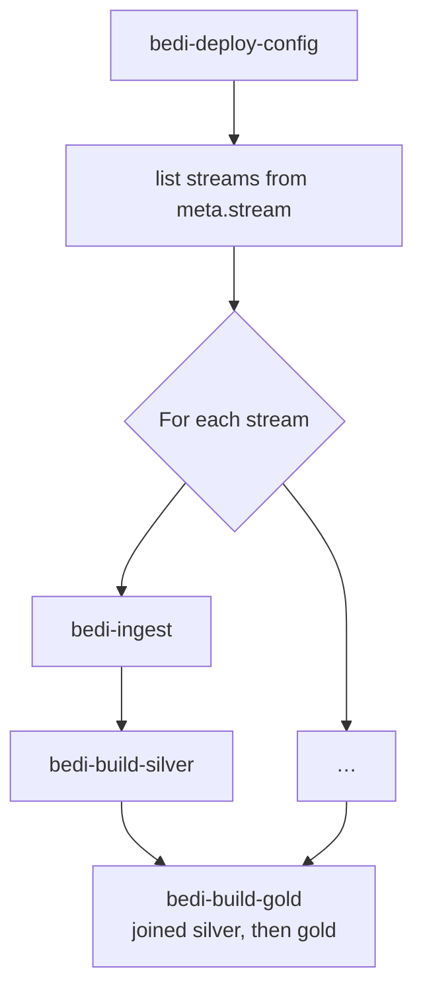

# BEDI Lakehouse Architecture — multi-source framework

**Customer:** Bosch
**Status:** design agreed, implementation not started.
**Supersedes:** [databricks_V2/docs/architecture.md](../databricks_V2/docs/architecture.md)

---

## Provenance

Three documents precede this one and none of them are being deleted.

| Document | What it is | Status |
|---|---|---|
| [databricks_v1/docs/architecture.md](../databricks_v1/docs/architecture.md) | The V1 single-entity PoC design | Frozen. Still runnable, and the reconciliation baseline |
| [databricks_V2/docs/scaling-to-a-framework.md](../databricks_V2/docs/scaling-to-a-framework.md) | The reasoning — what breaks when V1 is generalised | Current. This document does not repeat it |
| [databricks_V2/docs/architecture.md](../databricks_V2/docs/architecture.md) | The first V2 design, written assuming a notebook codebase | Historical record |

This document restates the V2 design for a **plain-Python, wheel-packaged codebase**. The data
model, historisation semantics and Unity Catalog layout are unchanged from the notebook-era V2
design; what changes is where code lives, how it is packaged, and how jobs invoke it.

> **This is a re-scoping of V1, not a rewrite.** Three things in V1 are scoped to "one entity" and
> need one more level of key. One thing needs to become pluggable. The per-tenant column-renaming
> machinery — the most expensive and least common capability in the codebase — carries over
> unchanged.

---

## What carries over unchanged

Settled by V1, not reopened here. Each is justified in the V1 document.

| Decision | Why it survives generalisation |
|---|---|
| Bronze is append-only, all values `STRING`, data in a `VARIANT` payload | Schema-agnostic ingest is what makes per-stream tables free of per-stream code |
| `_row_hash` is **catalog-free** — one hash over all normalised source values | Version boundaries must be a function of source data alone, never of our modelling |
| Deletes are **tombstone versions**, derived per full-load file by set difference | Physical deletes break rebuildability |
| `is_current` means *latest version AND still present in source* | One predicate for consumers; deleted entities have zero current rows |
| Silver = pure function of (bronze, mapping release) | The rebuild requirement is the reason bronze exists |
| Mapping is **names only**, values passed through as sent | Customer decision, 2026-08-13 |
| Custom historisation (`assign_versions`), not `AUTO CDC` | Decision 2026-08-18 |

### Historisation stays hand-written

`AUTO CDC` was spiked in [spike_auto_cdc](../databricks_V2/spike_auto_cdc/README.md) and works. It
is not being adopted. The reason is control rather than capability: version assignment is the most
consequential step in the pipeline, it is where both August 2026 bugs lived, and an explicit merge
can be unit-tested against a fixture and stepped through when a customer disputes a version
boundary.

One useful consequence. Because silver is built by **wheel tasks** rather than pipeline tasks, this
design is not subject to the documented limit that a pipeline task inside a `For each` task runs
one iteration at a time regardless of configured concurrency. Per-stream fan-out can actually run
in parallel.

---

## The three axes

| Axis | Example | V1 | Here |
|---|---|---|---|
| **Source system** | AAS Doors, SAP, Teamcenter | hardcoded | `source_system` — config |
| **Entity** | requirement, change request, BOM line | hardcoded | `entity` — config |
| **Tenant / variant** | FERRARI, MCLAREN | solved | `tenant_id` — unchanged mechanism |

**A *stream* is `(source_system, entity)`.** It is the unit of ingestion, ordering, parallelism and
failure. Tenants live *inside* a stream as a column, exactly as `project_id` does
today.

That single definition resolves most of V1's scaling problems, because everything V1 scoped
globally is correctly scoped per stream.

---

## Unity Catalog layout

**Catalog per environment**, which is what Databricks recommends (*"catalogs correspond to an
environment scope, team, business unit, or some combination"*).

| Environment | Catalog | Exists today |
|---|---|---|
| dev | `beg_bedi_dev` | **yes** |
| test | `beg_bedi_test` | no — not provisioned |
| prod | `beg_bedi_prod` | no — not provisioned |

Nothing in this design depends on test and prod existing. They are named now so that promotion is a
configuration change rather than a code change when they are created.

```
beg_bedi_dev
├── bronze     aas_doors__requirement, sap__material, …   one table per stream
├── silver     aas_doors__requirement, …                  one table per stream, plus joined datasets
├── gold       consumer-facing views and materialized views
└── meta       the framework's own state
```

Table naming is `<source_system>__<entity>`, double underscore, resolved from metadata and never
hardcoded. Single underscores are legal inside either part.

**One bronze table per stream**, not one global table. Independent OPTIMIZE and VACUUM, bounded
blast radius, parallel writers. The alternative — one table with an `entity` column —
forces every stream through one writer for sequence assignment.

### Developer isolation inside `beg_bedi_dev`

Several developers share the single dev catalog. Isolation is by **schema suffix**, not by catalog
and not by table name:

```
beg_bedi_dev.bronze_abaubinas, silver_abaubinas, gold_abaubinas, meta_abaubinas
```

- The suffix is one value, `schema_suffix`, supplied per run and empty in test and prod.
- It is applied in exactly one place — `naming.py` — so no query, view or DDL statement anywhere
  else in the codebase is aware that it exists.
- Table names are identical across developers and across environments. A silver table is
  `aas_doors__requirement` everywhere.

This works because each developer gets their own `meta`, so `stream_state` and `ingested_file`
cursors never collide. Two consequences worth planning for:

- If landing volumes are also suffixed, each developer needs their own fixture data. The fixture
  generator must therefore write into the suffixed volume, not a fixed path.
- If the landing volume is instead shared, ingestion still does not interfere, because
  processed-file state is per-`meta`. Each developer simply ingests the same files independently.

Per-developer *catalogs* would isolate more strongly but require catalog-creation rights and
duplicate the external locations and volumes for every person. Rejected on cost.

Job deployment is already isolated: both bundle targets run in `mode: development`, so each
developer deploys to `/Workspace/Users/<them>/.bundle/bedi-lakehouse/<target>/` with resources
prefixed `[dev <username>]`.

### What silver contains

Databricks' medallion guidance explicitly places joins and enriched datasets in silver, and states
that *"large amounts of historical data are typically accessed in the silver layer and not
materialized in the gold layer"*. An earlier draft of this design required silver to be strictly
single-entity and mechanical, with a separate `work` schema for anything joined. That was stricter
than the vendor's own guidance and has been dropped.

Silver therefore holds both:

- **Entity timelines** — one validated, non-aggregated timeline per entity, never joined, never
  aggregated. This is what the rebuild guarantee applies to.
- **Joined and enriched datasets** — derived from those timelines, no independent history, freely
  dropped and recomputed.

Only the first kind is rebuildable from bronze alone; the second is rebuildable from the first.
That distinction is a property of the table, recorded in `meta`, not a separate schema.

Gold stays consumer-facing only, and stays mostly logical.

### Landing areas are external volumes

Managed volumes are the default for most data, but landing zones should be **external volumes** on
an external location with **file events** enabled. File events are what make file-arrival triggers
and Auto Loader scale, and they directly address V1's `dbutils.fs.ls` O(n) discovery problem.

---

## Configuration is data, but it lives in git

The trap with "config as data" is untraceable production changes and no dev → prod promotion path.
Delta tables are not git.

The reconciliation: **declarations are files in the repository; a deploy job loads them into `meta`
as SCD2 versions.** Review, history and reproducible rebuilds come from git; runtime lookups and
point-in-time rebuild come from `meta`.

Three layers, all under a single top-level `config/` directory:

| Layer | Location | Format | Why |
|---|---|---|---|
| **1a — entity definition** | `config/sources/<source_system>/<entity>.yml` | YAML | Small, structured, human-authored |
| **1b — column mapping** | `config/mappings/<source_system>/<entity>.csv` | **CSV** | 1300 columns is not hand-editable YAML; it is a table, so it is stored as one |
| **2 — environment** | `config/environments/<env>.yml` | YAML | Catalog names, volumes, schedules — maps onto bundle `targets` |

Layer 1b being CSV is a deliberate concession to scale: it diffs acceptably in git, opens in Excel
for the analysts who actually know the column meanings, and imports without a parser.

### Config files are workspace files, not package data

`config/` is **not** packaged into the wheel. The bundle syncs it to the workspace, and
`bedi-deploy-config` reads it from there via a `--config-root` argument.

The deciding argument is that **only the deploy step ever reads these files** — every runtime job
reads `meta`. Mapping CSVs are owned by analysts and change on a different cadence to code, so
baking them into the wheel would mean a wheel rebuild and redeploy to correct a single column name.
As workspace files, a mapping fix is a pull request plus a `bedi-deploy-config` run.

### Entity definition — layer 1a

```yaml
source_system: aas_doors
entity: requirement

landing:
  volume: landing                      # resolved per environment
  path: aas_doors/requirement
  layout: "<tenant>/<load_mode>"       # folder contract, as V1
  format: csv
  options: { header: true }

grain:
  business_key: [object_id]
  tenant_column: project_id

historisation: scd2                    # scd2 | current_only | insert_only | append | snapshot

sequencing:
  source: manifest                     # manifest | file_mtime
  manifest_column: extract_seq

schema_evolution:
  new_column: accept                   # stays in payload, no action
  missing_business_key: fail           # stop the stream loudly

quality:
  required: [object_id, level]
  on_violation: quarantine             # quarantine | drop | fail
```

Everything here is per entity and none of it is code. Onboarding an entity is one YAML file plus
one CSV — no new modules and no new job definitions, which is the same promise V1 made for adding a
project, one level up.

### The `meta` tables

| Table | Holds | Historised | V1 equivalent |
|---|---|---|---|
| `meta.stream` | one row per `(source_system, entity)`: historisation, landing contract, format, policies | **SCD2** | `poc_config.py` |
| `meta.entity_column` | target schema per entity | **SCD2** | `GENERIC_COLUMNS` in Python |
| `meta.column_catalog` | `(source_system, entity, tenant, source_column) → generic_column` | **SCD2** | same, one key level narrower |
| `meta.mapping_release` | one row per release of the mapping set | **SCD2** | unchanged |
| `meta.dq_rule` | declarative rules per entity | **SCD2** | hardcoded in `silver_builder` |
| `meta.environment` | resolved layer 2: volumes and schedules | **SCD2** | did not exist |
| `meta.stream_state` | cursors: `last_ingest_seq`, `last_built_seq` per stream | current only | `meta.project_state` |
| `meta.ingested_file` | path + **content checksum** ledger | append only | `SELECT DISTINCT _source_file` scan |
| `meta.schema_registry` | header behind each `_schema_ver` | append only | unchanged |
| `meta.run_log` | per stream per run: files, rows, versions minted, no-op ratio, cast failures, duration | append only | did not exist |

`meta.ingested_file` fixes a real V1 defect, not just a performance one: the `_source_file` scan
silently mishandles a corrected file redelivered under the same name. Keying on path **and**
checksum makes "same name, new content" a supported case instead of silent data loss.

### Declarative metadata is SCD2, using the same columns as silver

Every table marked **SCD2** above carries the *identical* historisation columns that silver entity
tables carry. Not a parallel scheme, not `effective_from` here and `valid_from` there — the same
four column names everywhere in the lakehouse:

| Column | Type | Meaning |
|---|---|---|
| `version_no` | `INT` | 1-based, monotonic per business key |
| `valid_from` | `TIMESTAMP` | inclusive start of this version |
| `valid_to` | `TIMESTAMP` | exclusive end; `NULL` while open |
| `is_current` | `BOOLEAN` | latest version **and** still present in the declaration set |

The business key differs per table — `(source_system, entity)` for `meta.stream`,
`(source_system, entity, tenant, source_column)` for `meta.column_catalog` — but the historisation
columns and their semantics do not.

Three reasons this matters more for mapping than for anything else:

- **A silver rebuild must be reproducible.** Silver is defined as a pure function of
  *(bronze, mapping release)*. If the mapping set only ever held its current state, that function
  has no second argument for any date but today, and the rebuild guarantee is vacuous. `valid_from`
  / `valid_to` on `meta.column_catalog` is what makes "rebuild silver as it would have been built
  on 2026-06-01" a defined operation.
- **Mapping changes are the most likely cause of a disputed value.** When a customer asks why a
  column changed meaning, the answer must be a row with a `valid_from`, not a git archaeology
  exercise. Git holds the *review* history; `meta` holds the *runtime* history, and only the latter
  is joinable against the data it produced.
- **One set of helpers, one set of tests.** Because the columns are identical, the `scd2` module in
  `historisation/` closes and opens versions for `meta.column_catalog` using the same code path as
  for `silver.aas_doors__requirement`. There is no second implementation to keep in step, and the
  unit tests cover both.

`meta.mapping_release` remains the pinning mechanism: a silver build records the
`mapping_release_id` it used, and a rebuild replays with that id. The SCD2 columns on the mapping
tables are what let that id resolve to a *set of rows as they stood*, rather than to a label
attached to whatever the table happens to contain now.

**Deleting a declaration is a tombstone, never a physical delete.** A column dropped from a mapping
CSV closes its open version — `valid_to` set, `is_current` false — exactly as a deleted entity does
in silver. This is the same rule as bronze, applied one layer up, and for the same reason: a
physical delete makes the historical rebuild wrong.

---

## Ordering: `_ingest_seq` per stream

V1's single-writer constraint traces to one line:

```python
base_seq = spark.sql("SELECT coalesce(max(_ingest_seq), 0) FROM bronze").collect()[0]["s"]
```

A read-modify-write. It is not fundamental. `_ingest_seq`'s actual job is *a total, reproducible
order within one entity's timeline*, and entities never span streams.

**Two changes, in order of preference:**

1. **Derive it.** With a delivery manifest carrying a sequence number:
   `_ingest_seq = delivery_seq * 10^9 + row_num`. No read at all, so no writer serialisation, and
   rebuilds stay stable even when bronze is reprocessed out of order. This is the design to push
   the customer towards.
2. **Otherwise, scope the read per stream.** One writer per stream, all streams concurrent. Keeps
   V1's mtime-ordering logic including the same-mtime guard, which stays mandatory.

Cross-stream ordering is meaningless and is not attempted. This is the same argument V1 already
used to allow cross-project mtime ties.

> **Carried-over trap.** `os.utime` does not work on UC Volumes — it fails silently and the mtime
> stays the wall-clock write time. Any fixture generator that needs distinct mtimes must space its
> writes in real time. Volume mtime granularity is one second.

---

## Repository layout

All framework code is an ordinary importable package under `src/`, linted, formatted, type-checked
and unit-tested like any other Python library. There are no notebooks.

```
src/bedi_lakehouse/
├── config.py               load layer 1a/1b/2, validate, resolve environment
├── naming.py               stream + catalog + schema_suffix → fully qualified table name
├── discovery.py            list pending files, checksum, consult meta.ingested_file
├── readers.py              per-format readers; parse mode by load mode
├── hashing.py              norm / canon / _row_hash — pure, catalog-free
├── mapping.py              load_release, raw_expr, typed_expr, build_select
├── registry.py             schema_ver + drift policy
├── quality.py              declarative DQ evaluation → _dq_status
├── historisation/          scd2.py, current_only.py, insert_only.py, append.py, snapshot.py
├── transform/               joined silver datasets and gold builders (scaffolding this pass)
└── entrypoints/            one module per console script — argument parsing only

config/                     declarations, synced to the workspace, never packaged
├── sources/                layer 1a — entity YAML
├── mappings/               layer 1b — column CSV
└── environments/           layer 2 — dev/test/prod YAML

resources/                  bundle job definitions
tests/                      pytest — unit and fixture tests, no workspace required
design/                     this document
```

The split that matters: **everything under `src/bedi_lakehouse/` except `entrypoints/` is pure
library code that can be exercised without a Databricks workspace; `entrypoints/` only parses
arguments and calls it.** Both August 2026 bugs were in pure functions (`canon`, and the ordering
window) and would have been caught by unit tests.

What is *not* here, and stays where it is:

- `databricks_v1/` — frozen V1 PoC and reconciliation baseline. Excluded from Ruff.
- `databricks_V2/` — the notebook-era design record and the closed AUTO CDC spike. Excluded from
  Ruff. Kept runnable; not extended.
- `input/` — local source extracts. Git-ignored, contains customer data, never committed.

There is no `explore/` directory for scratch notebooks. Exploratory work belongs in the spike
folder that already exists, or in a personal workspace folder outside the repository.

---

## Entry points and wheel tasks

Jobs invoke the wheel through **console scripts**, one per pipeline layer, declared in
`[project.scripts]` in `pyproject.toml`.

| Console script | Module | Purpose |
|---|---|---|
| `bedi-init-uc` | `entrypoints.init_uc` | Create catalog, schemas, volumes and `meta` DDL. Idempotent, run rarely |
| `bedi-deploy-config` | `entrypoints.deploy_config` | Load `config/` declarations into `meta` as SCD2 versions |
| `bedi-ingest` | `entrypoints.ingest` | One stream → bronze |
| `bedi-build-silver` | `entrypoints.build_silver` | One stream → silver |
| `bedi-build-gold` | `entrypoints.build_gold` | Joined silver datasets, then `gold` |
| `bedi-rebuild-silver` | `entrypoints.rebuild_silver` | Full replay from bronze, plus reconciliation assertions |

One script per layer rather than a single `bedi <subcommand>` CLI, because a bundle
`python_wheel_task` names exactly one `entry_point`. Per-layer scripts make each task
self-describing in the run graph, give each its own argument parser, and keep failure attribution
unambiguous.

### Argument contract

Every entry point takes `--catalog` and `--schema-suffix`; per-stream tasks add `--stream`.

| Argument | Example | Supplied by |
|---|---|---|
| `--catalog` | `beg_bedi_dev` | bundle variable, per target |
| `--schema-suffix` | `_abaubinas` | bundle variable; empty in test and prod |
| `--stream` | `aas_doors__requirement` | `For each` input, from `meta.stream` |
| `--config-root` | `/Workspace/…/files/config` | bundle variable; `bedi-deploy-config` and `bedi-init-uc` only |

`--catalog` and `--schema-suffix` are the bootstrap: they are the minimum needed to locate `meta`.
Everything else — landing paths, historisation policy, schedules — is read from `meta`
at runtime, not passed as arguments.

`--stream` is a single `source_system__entity` string rather than two flags, because a `For each`
task iterates over single column values from `meta.stream`.

### Rules for entry point modules

These follow from the repository conventions in [AGENTS.md](../AGENTS.md) and are restated here
because they are easy to violate under time pressure:

- **Import must be side-effect free.** Spark session creation, catalog reads and any I/O happen
  inside `main()`, never at module scope.
- **Every argument arrives as a string on argv.** The entry point is the only validation boundary;
  it parses into a typed arguments object once, and nothing downstream re-parses strings.
- **Exit non-zero on failure.** A wheel task that returns normally is reported as a successful task
  regardless of what the data looks like.
- **No business logic.** If a function in `entrypoints/` is worth unit-testing, it is in the wrong
  module.

---

## Orchestration

One job per layer, fanning out over streams read from `meta.stream` — Databricks' own
[control table driving a `For each` job](https://learn.microsoft.com/azure/databricks/jobs/how-to/foreach-sql-lookup-tutorial)
pattern, *"the data, not the code, controls what the job processes"*.



- Ingest and silver fan out per stream and run concurrently — one writer per stream, no shared
  sequence, so no contention.
- Gold runs once, after all streams, because it may join across them.
- Triggered, not continuous. Databricks' guidance is that the vast majority of pipelines should be
  triggered.
- Production jobs run as **service principals**, not a user identity.

Environments map onto bundle `targets` in `databricks.yml`. Today there are two targets, `local`
and `dev`, both in `mode: development` and both pointing at `beg_bedi_dev`. `test` and `prod`
targets are added when those catalogs exist; no code changes when they are.

**Compute is deliberately not specified.** Whether jobs run on serverless or on classic job
clusters affects only how the wheel and its dependencies are attached to a task, not the module
boundaries, the argument contract or anything else in this document. The decision is deferred until
the workload size is known.

---

## Historisation policies

`build_silver` dispatches on the entity's declared policy. Everything upstream — staging, mapping,
hashing, deletion detection — is shared, and only the final step differs.

| Policy | Silver shape | Deletes | Incremental? |
|---|---|---|---|
| `scd2` | `version_no`, `valid_from`/`valid_to`, `is_current` | tombstone version | hard — full rebuild for now |
| `current_only` (Type 1) | one row per `entity_key` | DELETE or soft flag | **yes, cheap** |
| `insert_only` (Type 0) | append, first write wins | ignored | yes |
| `append` | no key, no dedup | n/a | yes |
| `snapshot` | partitioned by delivery date | implicit | yes |

The `scd2` policy is also what `bedi-deploy-config` uses to version the declarative `meta` tables.
It takes a business key, a hash of the remaining columns and a set of incoming rows, and closes,
opens or leaves versions alone. Nothing in it is specific to entity data, so metadata versioning
costs no additional implementation.

Two observations worth recording:

- **Type 1 is a strict simplification of SCD2** — take the last row per key by `_ingest_seq`.
  Identical staging and mapping; only the final window changes.
- **The no-op collapse stops mattering under Type 1.** Resent unchanged rows are harmless, and the
  `_row_hash` anti-join survives purely as a cost optimisation. The `StructType.add` bug was
  SCD2-specific *in its consequences* — under Type 1 it would have been invisible.

---

## Data quality

V1 hardcodes `level or object_id is null` inside `silver_builder`. This design evaluates
`meta.dq_rule` per entity: required columns, value domains, thresholds, with `quarantine` / `drop`
/ `fail` behaviour declared per entity.

Quarantined rows are written, flagged `_dq_status`, and excluded by the gold views — never dropped,
because bronze must stay reproducible into silver.

---

## Testing

Non-negotiable, because the failure modes seen so far are silent — a green run producing a
plausible-looking table.

| Level | Target | Runs on |
|---|---|---|
| Unit | pure functions: `canon`, hashing, `raw_expr`, `naming`, each historisation policy | local Spark, CI, no workspace |
| Fixture | generated deliveries covering resend / change / delete / schema drift | local Spark |
| Reconciliation | rebuild vs incremental; new output vs V1 baseline for AAS Doors | workspace |

All tests live in the repository-root `tests/` directory, which is what `pytest` is configured to
collect. Coverage is measured on `src/` with a floor of 80 percent, so framework modules that are
hard to test without a workspace must be split until the pure part is testable.

The reconciliation harness is available for free:
[91_verify_stage2.py](../databricks_V2/spike_auto_cdc/explorations/91_verify_stage2.py) already
compares two historisation implementations on entity sets, version counts, current state and
version boundaries. It was written for the spike and is retained as a standing regression harness —
the new AAS Doors output must reproduce V1's `silver.entities` exactly.

**Row-count reconciliation must be an automated assertion, not a manual check.** The AUTO CDC spike
produced 431 versions where 274 were expected, and the pipeline reported success; only an assertion
caught it.

---

## Code conventions

Framework code is held to the same standards as the rest of the repository, enforced by Ruff in
pre-commit and CI.

| Rule | Value |
|---|---|
| Line length | 120 |
| Indent | 4 spaces |
| Quotes | double |
| Docstrings | Google style |
| Ruff rule sets | `E`, `F`, `I`, `N`, `PLR` |
| Test layout | `tests/`, `test_*.py`, `Test*`, `test_*` |
| Coverage floor | 80 percent of `src/` |

Two conventions specific to this codebase:

- **`naming.py` is the only module that builds a table name.** Catalog, schema, schema suffix and
  the `source_system__entity` convention are assembled in one place. A string literal containing a
  three-part name anywhere else is a defect.
- **`hashing.py` stays catalog-free and dependency-free.** It must not import config, naming or
  anything that reads `meta`. The rebuild guarantee depends on `_row_hash` being a function of
  source values alone.

And one that spans the data model rather than the code: **`version_no`, `valid_from`, `valid_to`
and `is_current` are the only historisation column names used anywhere**, in silver and in `meta`
alike. A table that needs a different name for one of these concepts is a design problem, not a
naming problem.

---

## Deliberately deferred

| Item | Why not now |
|---|---|
| Data retention, archival and purge | Bronze rows are kept indefinitely. No storage pressure and no legal retention requirement has been stated. Delta table maintenance — OPTIMIZE and VACUUM — is a separate concern and stays in scope |
| Compute model — serverless versus job clusters | Workload size unknown. Affects packaging only, not design |
| Incremental SCD2 merge | V1's full rebuild is correct; incremental is an optimisation with a correctness cliff. Build the reconciliation harness first |
| Blue/green swap | Design only, per instruction 2026-08-14 |
| Out-of-order arrival within a stream | Detect and quarantine; rebuild that stream. Routine tooling only if the customer confirms it happens |
| Streaming / near-real-time | No SLA established. Would change the ingest design materially |
| Star schema in gold | Depends on whether consumers need point-in-time joins across entities |
| `transform/` beyond scaffolding | Gold shape follows consumer requirements, which are not gathered |
| `test` and `prod` catalogs | Not provisioned. Named here so promotion stays a config change |

---

## Open questions that block parts of this design

Carried from [scaling-to-a-framework.md §6](../databricks_V2/docs/scaling-to-a-framework.md).
Listed here because each one blocks a specific decision above, rather than being a general unknown.

| Question | Blocks |
|---|---|
| Do delta files carry **complete rows**? | Whether hashing can compare rows directly, or must merge onto the last version first |
| Can sources provide **manifests** (row count, sequence number, checksum)? | The derived `_ingest_seq` design; the truncated-full-load guard |
| Can a full load arrive **truncated**? | Whether tombstone minting needs a row-count floor |
| Can extracts arrive **out of order** within a stream? | Whether late arrival is routine tooling or break-glass |
| Does the **per-tenant column renaming** pattern recur beyond AAS Doors? | Whether the catalog machinery is core or an AAS Doors quirk |
| Who maintains the mappings — engineers or analysts? | YAML-in-git versus a UI. Hard to reverse |
| **Erasure** requirements? | Whether immutable bronze survives contact with GDPR |
| Per-project **access isolation**? | Whether silver is shared or per-tenant |

The first two are the highest value. A manifest with a sequence number retires an entire class of
ordering bugs — including the one that cost a debugging cycle on 2026-08-14 — and unlocks the best
available `_ingest_seq` design.
