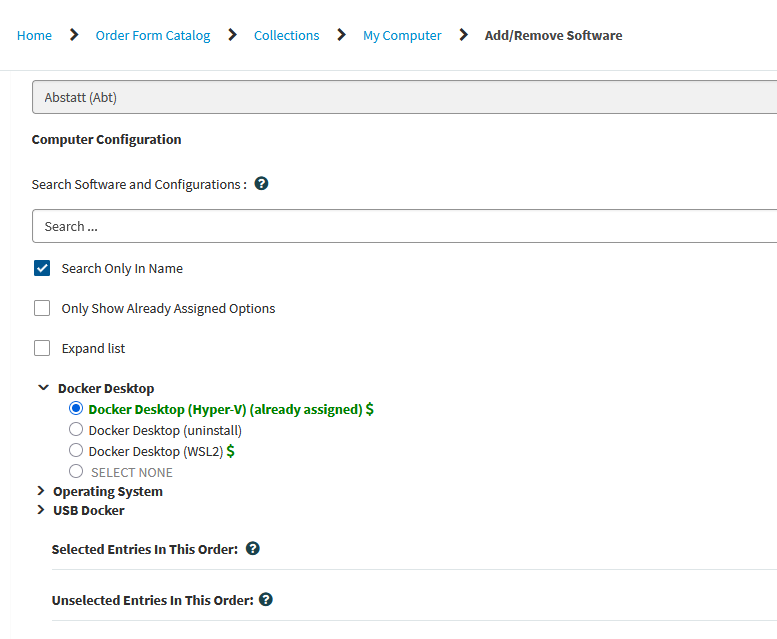
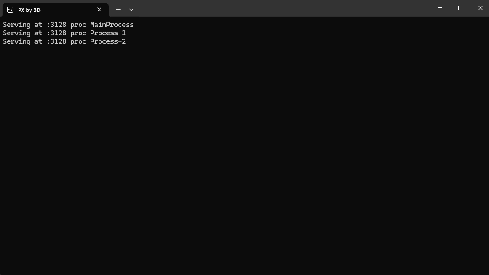
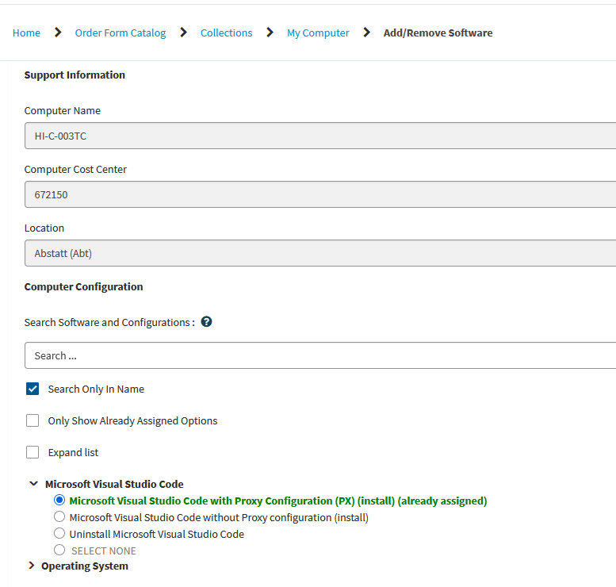
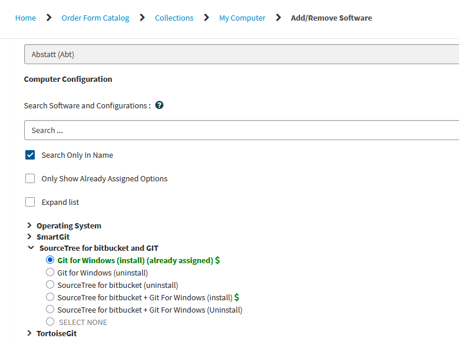

# Installation

Get started with the AAS Doors Lakehouse project.

## Getting the Repository

```bash
git clone https://github.com/velniaszs/dbricks_test.git
cd dbricks_test
```

---

## Dev Container (recommended)

The fastest way to set up your development environment:

### Prerequisites in OSD

1. **Docker Engine** — For working with Docker in OSD, usually only the Docker Engine is needed (not Docker Desktop as on Windows/Mac). Docker Engine is available under the Apache-2.0 License (status 13.02.2026).

    !!! warning "Docker Desktop vs. Docker Engine"
        The [official guide](https://docs.docker.com/engine/install/ubuntu/) recommends the bundle with Docker Desktop, but only the Engine is Apache-licensed. If Docker Desktop is installed on your system, you need to request a license as described in the [Docker Desktop documentation](https://inside-docupedia.bosch.com/confluence/spaces/DEVCORNER/pages/1595519397/Docker+Desktop+for+Windows).

2. [**VS Code**](https://code.visualstudio.com/)
3. [**Dev Containers extension**](https://marketplace.visualstudio.com/items?itemName=ms-vscode-remote.remote-containers)

### Installation of Prerequisites in Windows/Mac inside BCN

1. **Docker Desktop** — Install via the [IT Service Portal](https://service-management.bosch.tech/sp?id=sc_cat_item&sys_id=b08ed16c1b83c91078087403dd4bcbb1&table=sc_cat_item&searchTerm=install%20software). Docker Desktop for Windows and Mac needs a paid license, which is acquired automatically when installed through the portal. Alternatives are listed in the [Docker Desktop documentation](https://inside-docupedia.bosch.com/confluence/spaces/DEVCORNER/pages/1595519397/Docker+Desktop+for+Windows) (not recommended).

    

    After installation, log in once. To enable Docker to reach its online resources, **PX by BD** needs to run. It is installed automatically with Docker Desktop and can be found by typing it in the search bar of your taskbar (similar on Mac). It is a preconfigured proxy.

    1. Start **PX by BD**. It opens a command window:
       
    2. Open Docker Desktop
    3. Log in with your Bosch email address (`firstname.lastname@bosch.com`; if that doesn't work, try `firstname.lastname@de.bosch.com`)
    4. Docker Desktop is ready — you will work in VS Code from here

2. **VS Code** — Also available via the [IT Service Portal](https://service-management.bosch.tech/sp?id=sc_cat_item&sys_id=b08ed16c1b83c91078087403dd4bcbb1&table=sc_cat_item&searchTerm=install%20software).

    

3. **Dev Containers extension** — Install inside VS Code via the Marketplace.

4. **Git** (if not already installed) — Also available via the [IT Service Portal](https://service-management.bosch.tech/sp?id=sc_cat_item&sys_id=b08ed16c1b83c91078087403dd4bcbb1&table=sc_cat_item&searchTerm=install%20software).

    


### Setup

1. Start "PX by BD" and Docker Desktop on your system
2. Open the project in VS Code
3. Click "Reopen in Container" when prompted (or use Command Palette → "Dev Containers: Reopen in Container")

The container includes:

- **Ubuntu 22.04** with Python 3.12
- **uv** - Fast Python package manager
- **Databricks CLI** - Workspace management
- **Azure CLI** - Azure authentication
- **All VS Code extensions** pre-configured

### Authentication Persistence

The dev container mounts your local credentials for seamless authentication:

- `~/.databrickscfg` - Databricks CLI profiles
- `~/.azure` - Azure CLI credentials

Configure authentication once on your host, and it persists across container rebuilds.

---

## Initial Setup

### 1. Install Dependencies

```bash
uv sync --dev
```

This will:

- Create a virtual environment in `.venv/`
- Install Python 3.12 if not available
- Install all project and development dependencies
- Install Databricks Connect and SDK

### 2. Configure Databricks

Edit `databricks.yml` with your workspace URL:

```yaml
targets:
  dev:
    workspace:
      host: https://your-workspace.azuredatabricks.net
```

### 3. Authenticate

Use the **Databricks VS Code extension** for authentication:

1. Open the **Databricks** panel in the VS Code sidebar
2. Click **Sign in to Databricks workspace**
3. Enter your workspace URL (e.g., `https://your-workspace.azuredatabricks.net`)
4. Select **OAuth (User to Machine)** as the authentication method
5. Complete the browser-based OAuth flow

!!! tip "Why OAuth?"
    OAuth is the recommended authentication method. It avoids storing long-lived tokens and integrates with your organization's identity provider (e.g., Azure AD / Entra ID).

!!! note "Extension required"
    Install the [Databricks extension for VS Code](https://marketplace.visualstudio.com/items?itemName=databricks.databricks) if not already installed. It is included in the recommended extensions for this project.

### 4. Verify Installation

```bash
# Run tests
uv run pytest

# Check linting
uv run ruff check

# Verify Databricks connection (optional)
uv run python -c "from databricks.connect import DatabricksSession; print('OK')"
```

---

## Manual Installation

For local development without containers:

### Required Software

| Software | Version | Purpose |
|----------|---------|---------|
| Python | 3.12 | Runtime (matches Databricks Runtime 18.0+) |
| uv | Latest | Fast Python package manager |
| Git | Latest | Version control |
| Databricks CLI | Latest | Workspace authentication |

### Installing uv

=== "macOS/Linux"

    ```bash
    curl -LsSf https://astral.sh/uv/install.sh | sh
    ```

=== "Windows"

    ```powershell
    powershell -c "irm https://astral.sh/uv/install.ps1 | iex"
    ```

=== "pip"

    ```bash
    pip install uv
    ```

### Installing Databricks CLI

=== "macOS"

    ```bash
    brew install databricks/tap/databricks
    ```

=== "Linux/Windows"

    ```bash
    curl -fsSL https://raw.githubusercontent.com/databricks/setup-cli/main/install.sh | sh
    ```

---

## Next Steps

- [Quick Start](quick-start.md) - Start developing
- [Configuration](configuration.md) - Understand configuration files
