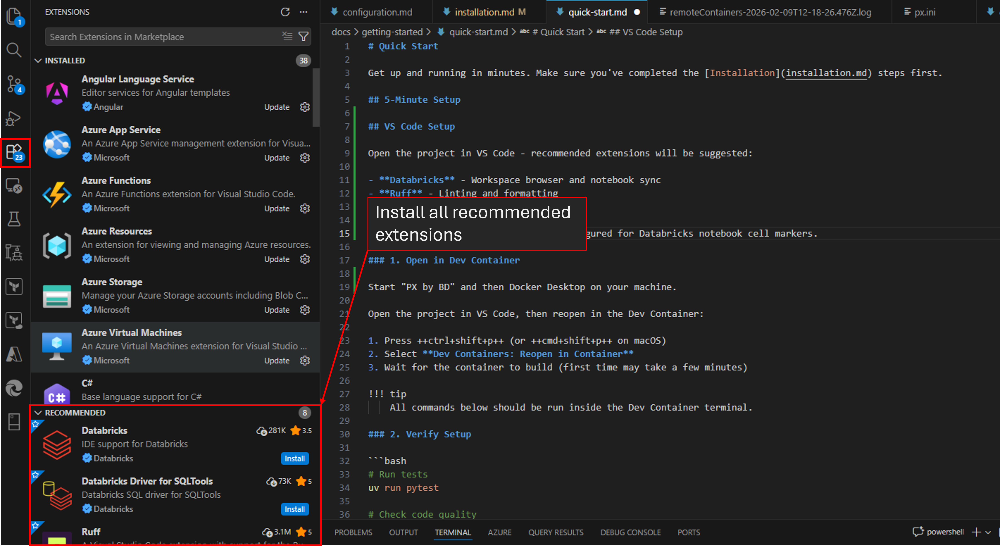

# Quick Start

Get up and running in minutes. Make sure you've completed the [Installation](installation.md) steps first.

## VS Code Setup

Open the project in VS Code — recommended extensions will be suggested:

- **Databricks** - Workspace browser and notebook sync
- **Ruff** - Linting and formatting
- **Python** - IntelliSense

Easiest is to install all recommended extensions:



The `.vscode/settings.json` is pre-configured for Databricks notebook cell markers.

### 1. Open in Dev Container

Start "PX by BD" and then Docker Desktop on your machine.

Open the project in VS Code, then reopen in the Dev Container:

1. Press ++ctrl+shift+p++ (or ++cmd+shift+p++ on macOS)
2. Select **Dev Containers: Reopen in Container**
3. Wait for the container to build (first time may take a few minutes)

!!! tip
    All commands below should be run inside the Dev Container terminal.

### 2. Verify Setup

```bash
# Run tests
uv run pytest

# Check code quality
uv run ruff check

# Serve documentation
uv run mkdocs serve
```

### 3. Configure Databricks

At this point you should have accounts in Azure Databricks generated by the Lakehouse Team. In addition to your accounts, you need a workspace on Databricks and resources such as a cluster to run your tasks. If any of these are still missing in your setup, please contact Alexander.Zanker@de.bosch.com.

Edit `databricks.yml`:

```yaml
targets:
  dev:
    workspace:
      host: https://your-workspace.azuredatabricks.net
```


## Essential Commands

| Task | Command |
|------|---------|
| Install dependencies | `uv sync --dev` |
| Run tests | `uv run pytest` |
| Run tests with coverage | `uv run pytest --cov=src/` |
| Lint code | `uv run ruff check` |
| Format code | `uv run ruff format` |
| Serve documentation | `uv run mkdocs serve` |
| Build documentation | `uv run mkdocs build` |

## Project Structure

```
├── src/bedi_lakehouse/          # Your code goes here
├── tests/                            # Test files
├── docs/                             # Documentation
├── resources/                        # Databricks workflow resources
├── typings/                          # Type stubs for IDE support
├── databricks.yml                    # Databricks Asset Bundles config
└── pyproject.toml                    # Project configuration
```

## Development Workflow

### Adding Code

1. Add your modules to `src/bedi_lakehouse/`
2. Write tests in `tests/`
3. Run tests: `uv run pytest`
4. Check linting: `uv run ruff check`

### Pre-commit Hooks

```bash
# Install hooks (run once)
uvx pre-commit install

# Run manually
uvx pre-commit run --all-files
```

### Using Databricks Connect

With Databricks Connect you can connect to Databricks from VS Code. You can log in to Databricks from within VS Code. What you then develop and test in VS Code is automatically deployed and processed in Databricks. The Lakehouse Team has set up four instances:

| Instance | Purpose |
|----------|--------|
| Local | For you to freely try out and test |
| Development | Shared development environment |
| Quality Assurance | Pre-production validation |
| Production | Live workloads |

The setup is preconfigured to let you first work on the **Local** instance.

```python
from databricks.connect import DatabricksSession

spark = DatabricksSession.builder.getOrCreate()
df = spark.sql("SELECT 1")
df.show()
```

## Troubleshooting

### Databricks Connect Issues

```bash
# Verify cluster is running
databricks clusters list

# Check authentication
databricks auth describe

# Test connection
uv run python -c "from databricks.connect import DatabricksSession; DatabricksSession.builder.getOrCreate()"
```

### Virtual Environment Issues

```bash
# Recreate environment
rm -rf .venv
uv sync --dev
```

### Other Troubleshooting

The Lakehouse Team provides a Teams channel where you can ask questions and post problems. A team member will answer as soon as possible. If the answer helped you, please note that in the channel to help others.

## Next Steps

- [Configuration](configuration.md) - Configuration files reference
- [Testing](../development/testing.md) - Testing guide
- [Code Quality](../development/code-quality.md) - Linting setup
